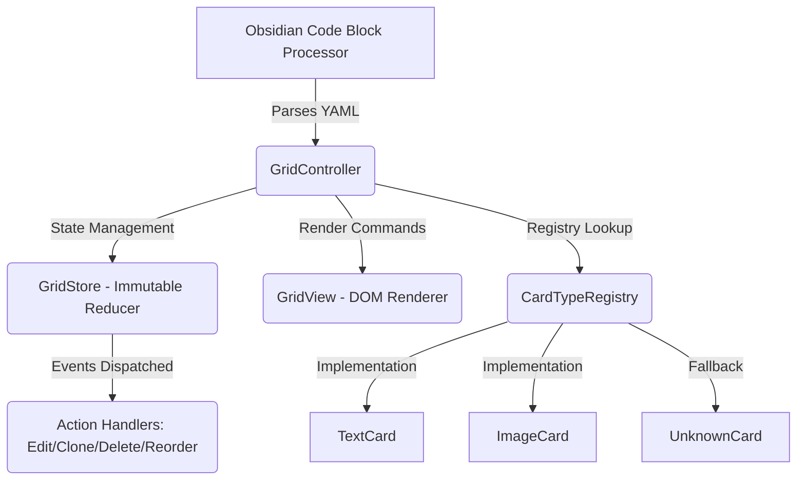

# Obsidian Card Grid — Complete Documentation

## 1. Purpose & Overview

**Card Grid** is an Obsidian Markdown plugin that renders structured data as responsive CSS grid layouts using a custom code fence syntax (`\`\`\`card-grid`). It enables users to transform YAML-formatted card definitions into visual knowledge representations within any note.

### Target Users
- **Knowledge workers** organizing concepts visually
- **Students** using spatial learning techniques  
- **Designers/architects** mapping relationships to grids
- **Researchers** visualizing concept connections
- Anyone needing quick-reference dashboards embedded in notes

## 2. Architecture & Design Patterns

### High-Level Flow



### Key Architectural Patterns

**1. Registry Pattern (Open/Closed Principle)**
- New card types added in `cards/types/` without touching core code
- Central dispatcher (`registry.ts`) routes based on type string
- Forward compatibility via `unknownCardType` fallback

**2. Reducer/Unidirectional Data Flow**  
- Immutable state updates via typed actions (`actions.ts`)
- Single source of truth: `GridStore` holds canonical state
- Diffing optimization: returns same object if no changes detected

**3. Factory Pattern for Rendering**
```typescript
createView(ctx: CardViewContext): CardView<TCard>
```
Each card type provides its own DOM rendering factory, enabling distinct structures per type.

**4. Repository/Port-Adapter Pattern**
- `CardGridRepository` abstracts persistence away from controller  
- Encapsulates Obsidian Vault API complexity (fence matching, block replacement)
- Handles save debouncing and resource URL resolution

## 3. Core Features & Capabilities

### Supported Card Types

| Type | Description | Key Fields |
|------|-------------|------------|
| **Text** | Title + markdown body | `title`, `text` (markdown), colors, custom layout overrides |
| **Image** | Photo with optional overlay text | `image`, `title`, extensive styling (fit/position/radius) |

### Configuration Options

**Grid-level Settings:**
```yaml
columns: 3              # Grid column count  
gap: 10                 # Gap between cards in pixels  
imageFit: "cover"       # cover|contain|fill|none|scale-down
imageHeight: 180        # Max image height
imagePosition: "center" # CSS object-position value
```

**Card-level Overrides:**
- Individual cards can override any grid setting
- Custom colors (border, background, text) via hex values
- Per-card column/gap configuration for asymmetric layouts

### User Interactions

| Action | Handler | Description |
|--------|---------|-------------|
| **Edit** | `editCard()` | Opens modal with field-aware editor based on card type |
| **Clone** | `cloneCard()` | Creates duplicate preserving ID prefix for deduplication |
| **Delete** | `deleteCard()` | Removes from registry, updates view immediately |
| **Reorder** | `moveCard()` | Future extensibility (action dispatched but not yet wired to UI) |

## 4. File Structure & Responsibilities

```
domain/                    # Immutable contracts
├── codec.ts               # UUID generation, JSON/YAML serialization  
├── defaults.ts            # Grid defaults (column count, gaps, etc.)
└── types.ts               # CardGridData, CardInstance interfaces

cards/                     # Registry implementations  
├── index.ts               # Factory: createDefaultRegistry()  
├── registry.ts            # Abstract CardTypeDefinition interface  
├── shared/imageStyle.ts   # Image CSS computation logic  
└── types/                 # Concrete card definitions
    ├── textCard.ts        # Text card schema + rendering factory
    ├── imageCard.ts       # Image card with extensive styling support
    └── unknownCard.ts     # Fallback for unrecognized type strings

controller/                # Business Logic Layer  
└── GridController.ts      # Event handling, action dispatch, view commands

infrastructure/            # External integrations  
├── CardGridRepository.ts  # Persistence via YAML file editing
└── yaml.ts                # Yaml parsing/stringification helpers

plugin/                    # Obsidian Entry Points  
├── CardGridPlugin.ts      # onload(), markdown processor registration  
├── GridRenderChild.ts     # MarkdownRenderChild lifecycle hook  
└── menus/cardMenu.ts      # Context menu handlers (Edit/Clone/Delete)

state/                     # Unidirectional State Management  
├── actions.ts             # Action union type (IMMUTABLE ADDITIONS ONLY)
└── gridStore.ts           # Reducer function, subscription pattern

ui/                        # Presentation Layer  
├── GridView.ts            # Card DOM renderer with ID-based memoization
├── modals/CardEditorModal.ts      # Generic field editor (renders based on spec)
├── modals/CardTypeSuggestModal.ts  # Type selection dialog
└── modals/ImagePickerModal.ts     // Vault file browser

styles.css                 # Compiled CSS with scoped class names (.card-grid-*)
main.js                    # Bundled output (generated by esbuild)
```

## 5. Data Flow & State Management

### Immutable Update Pattern
The reducer follows strict immutability rules:

```typescript
// GridStore actions are union types, never extended
type Action = 
  | { type: 'ADD_CARD'; payload: CardData }
  | { type: 'REMOVE_CARD'; id: string }  
  | { type: 'UPDATE_FIELD'; cardId: string; field: string; value: any }

function reducer(state: GridState, action: Action): GridState {
  if (action.type === 'ADD_CARD') {
    return { ...state, cards: [...state.cards, action.payload] };
  }
  // ... other handlers
}
```

### Subscription Pattern for Re-rendering
```typescript
// When state changes, notify all subscribers
function dispatch(action) {
  const newState = reducer(state, action);
  if (newState === state) return; // Skip render if no change
  
  state = newState;
  subscribers.forEach(listener => listener(newState));
}

// GridView subscribes to state changes and calls redraw()
```

## 6. Extensibility Guide

### Adding a New Card Type

1. **Implement the Interface** (`cards/types/myspecialCard.ts`):
   ```typescript
   export class MySpecialCard implements CardTypeDefinition<MySpecialData> {
     type = 'my-special';
     
     // Form field definitions for editor modal
     getEditorSpec() { 
       return [{type: 'text', name: 'name'}, ...]; 
     }
     
     // Input normalization/validation  
     normalize(raw): MySpecialData {
       return { ...raw, validated: true };
     }
     
     // DOM rendering factory
     createView(ctx) { 
       return new MyCardView(ctx); 
     }
   }
   ```

2. **Register in Index** (`cards/index.ts`):
   ```typescript
   export function createDefaultRegistry() {
     const registry = new CardTypeRegistry();
     
     // Register your type here
     registry.register(new MySpecialCard());
     
     return registry;
   }
   ```

3. **Usage in YAML**:
   ```yaml
   cards:
     - type: "my-special"
       name: "My Special Data"  # Field from editor spec
       customField1: value      // Preserved via UnknownCard wrapper
   ```

### Adding Grid Configuration Options

Edit `domain/defaults.ts`:
```typescript
export const DEFAULT_GRID_VERSION = 2;

export interface GridDefaults {
  columns: number;           // Add new defaults here
  gap: number;
  imageFit?: string;         // Optional custom config
  customOption: boolean;     // Your custom setting
}
```

## 7. Technical Implementation Details

### ID Generation Strategy
- **Primary**: `crypto.randomUUID()` (modern browsers/Electron)  
- **Fallback**: Random hex + timestamp concatenation for legacy environments  
- **Deduplication**: Cloned cards preserve prefix to avoid duplicate IDs in vault storage

### Serialization Philosophy
- **codec.ts**: Pure functions, no side effects  
- Preserves unknown properties via `UnknownCard` type (`[key: string]: unknown`)  
- Normalization happens at registration boundary only (not during save/load)

### Performance Optimizations
1. **Async Rendering**: MarkdownRenderer uses async to avoid UI blocking  
2. **Diffing**: GridStore skips re-render when state unchanged  
3. **Memoized DOM**: `GridView.cardDom` map reuses DOM nodes for type changes by ID  
4. **Lazy Images**: Only load images when card is rendered, not on initial parse  

### Data Safety
- Save debouncing (250ms) prevents excessive writes during rapid edits  
- YAML source cleanup handles non-breaking spaces and tabs  
- Lazy image loading prevents memory exhaustion with many cards

## 8. Usage Examples

### Basic Text Card Grid
```yaml
\`\`\`card-grid
columns: 3
gap: 20

cards:
  - title: Feature A
    text: Description here...
    color: "#4A90E2"
  
  - title: Feature B  
    backgroundColor: "#FFF5E6"
\`\`\`
```

### Image Card with Custom Styling
```yaml
\`\`\`card-grid
columns: 2
gap: 30
imageFit: contain
imageHeight: 150

cards:
  - image: https://picsum.photos/400/300
    title: Architecture Diagram
    backgroundColor: "#F8F9FA"
\`\`\`
```

### Mixed Type Grid with Overrides
```yaml
\`\`\`card-grid
columns: 4

cards:
  - type: "text"
    columns: 2           # Override grid setting for this card only
    gap: 15              # Override gap too
    
  - image: ./docs/diagram.png
    text: Caption overlay (if supported)
\`\`\`
```

## 9. Development Workflow

**Commands**:
- `npm run dev` — Watch mode with hot-reload on file changes
- `npm run build` — Production bundle optimization  
- `npm run watch` — ESBuild live compilation for debugging

**Entry Points**:
1. `main.ts` → Exports default `CardGridPlugin` instance  
2. `esbuild.config.mjs` → Bundles TypeScript to CommonJS (`main.js`)  
3. Obsidian loads manifest, then imports `main.js`  

**Lifecycle**:
- `onload()` registers markdown processor for `card-grid` fence syntax  
- Creates default registry in controller  
- Sets up event listeners on DOM ready

## 10. Dependencies & Build Toolchain

**Runtime**:
```json
{
  "js-yaml": "^4.1.0"       // YAML parsing for input/output
}
```

**Dev/Test**:
```json
{
  "@types/js-yaml",         // TypeScript definitions  
  "@types/node",            // Node typing for esbuild compatibility
  "esbuild",                // Fast bundler with tree-shaking  
  "obsidian"                // Obsidian plugin API types
}
```

**CSS**: Compiled via `styles.css` generation, scoped to prevent conflicts (`card-grid-*` prefix).
