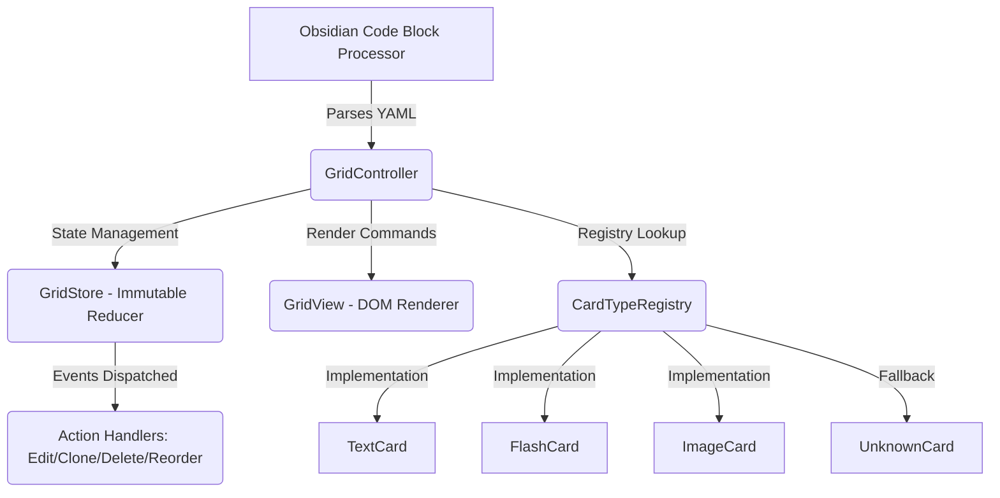

# Obsidian Card Grid

A powerful Obsidian plugin to transform YAML code blocks into beautiful, interactive, and responsive card grids.

## 🚀 Getting Started

To create a grid, use the `card-grid` code fence:

```yaml
```card-grid
columns: 3
gap: 15

cards:
  - title: Hello World
    text: This is a text card.
    backgroundColor: "#2d2d2d"
  - type: image
    image: "attachments/photo.jpg"
```
```

## 🛠 Core Features

- **Interactive Resizing**: Click and drag the edges of cards to adjust their width distribution dynamically.
- **Registry Architecture**: Multiple specialized card types (Text, Image, Flashcard, Procedure).
- **State Persistence**: Automatic, debounced saving back to your Markdown file.
- **Context Menus**: Right-click cards to edit, clone, move, or delete them.

## 2. Architecture & Design Patterns

### High-Level Flow



### Key Architectural Patterns

**1. Registry Pattern (Open/Closed Principle)**
- Built-in card types: Text, Flash, Image, Spacer, Unknown (forward-compatible)
- Factory pattern via `CardTypeDefinition<TCard>` interface with generics
- Central dispatcher (`registry.ts`) routes via Map-based lookup
- Each type implements: normalize(), createView(ctx), getEditorSpec()

**2. Reducer/Unidirectional Data Flow**
- Strict immutability via switch-case reducer (no external libraries)
- Typed action union (`GridAction`) prevents runtime type errors
- Single source of truth with `subscribe()` listener pattern
- Diffing optimization: `if (next === prev) return` skips renders

**3. Factory Pattern for Rendering**
```typescript
createView(ctx: CardViewContext): CardView<TCard>
```
Each card type provides its own DOM rendering factory, enabling distinct structures per type.

**4. Repository/Port-Adapter Pattern**
- `CardGridRepository` abstracts vault I/O with intelligent reference resolution
- ID-first lookup strategy with fallback to line-range references
- Save debouncing (250ms chain-based) prevents race conditions during rapid edits

## 3. Card Types Reference

| Type | Description | Key Fields |
|------|-------------|------------|
| **Text** | Title + markdown body | `title`, `text` (markdown), colors, custom layout overrides |
| **Flash** | Photo with optional overlay text | `image`, `title`, extensive styling (fit/position/radius), Markdown rendering support |
| **Image** | Pure photo display | `image`, extensive styling (fit/position/radius) |
| **Spacer** | Empty placeholder for column control | `width` (in columns), used to span multiple cards horizontally |
| **Unknown** | Fallback for unrecognized types | Preserves raw data structure, enables forward compatibility |
| **Procedure**| Specialized workflow/step card | `title`, `text`, `image` |

### Configuration Options

**Grid-level Settings:**
```yaml
columns: 3              # Grid column count (affects spacer width)
gap: 10                 # Gap between cards in pixels
imageFit: "cover"       # cover|contain|fill|none|scale-down
imageHeight: 180        # Max image height
imagePosition: "center" # CSS object-position value
imageRadius: 4          # Border radius for images (pixels)
```

**Card-level Overrides:**
- Individual cards can override any grid setting (`columns`, `gap`)
- Custom colors (background, text) via hex values
- Per-card image styling (fit/height/position/radius)
- Width property: Controls flex basis for multi-column layout control

### User Interactions

| Action | Handler | Description |
|--------|---------|-------------|
| **Edit** | `editCard()` | Opens modal with field-aware editor based on card type |
| **Clone** | `cloneCard()` | Creates duplicate preserving ID prefix for deduplication |
| **Delete** | `deleteCard()` | Removes from registry, updates view immediately |
| **Move** | `moveCard()` | Move cards up/down via context menu actions |

## 4. File Structure & Responsibilities

```
domain/                    # Immutable contracts
├── codec.ts               # UUID generation, YAML serialization with error handling
├── defaults.ts            # Grid configuration defaults (columns, gaps, image constraints)
└── types.ts               # CardGridData, BaseCard, BuiltInCard interfaces

cards/                     # Registry implementations (Registry Pattern)
├── index.ts               # Factory: createDefaultRegistry() with built-in types
├── registry.ts            # Abstract CardTypeDefinition<TCard> interface
├── shared/imageStyle.ts   # Image constraint-based styling inheritance logic
└── types/
    ├── textCard.ts        # Text card: MarkdownRenderer integration, rich content
    ├── flashCard.ts       # Flash card: Multi-line rendering, fit/position constraints
    ├── spacerCard.ts      # Spacer card: Flex basis for multi-column layout control
    └── unknownCard.ts     # Safety net preserving raw data for forward compatibility

controller/                # Business Logic Layer (Controller Pattern)
└── GridController.ts      # Event orchestration, saveChain debouncing, resize guards

plugin/                    # Obsidian Entry Points  
├── CardGridPlugin.ts      # onload(), markdown processor registration  
├── GridRenderChild.ts     # MarkdownRenderChild lifecycle hook  
└── menus/cardMenu.ts      # Context menu handlers (Edit/Clone/Delete)

state/                     # Unidirectional State Management (Reducer Pattern)
├── actions.ts             # GridAction union type: immutable additions only
└── gridStore.ts           # publish-subscribe pattern with skip-during-resize guard

ui/                        # Presentation Layer (Component-based)
├── GridView.ts            # Flexbox renderer with cardDom Map memoization, resize guards
├── CardResizer.ts         # Drag handles between cards, flex basis adjustment
├── modals/CardEditorModal.ts      # Builder pattern: dynamic field rendering from specs
├── modals/CardTypeSuggestModal.ts  # Type selection with suggestions
└── modals/ImagePickerModal.ts     // Native Obsidian file picker integration

styles.css                 # Compiled CSS with scoped class names (.card-grid-*)
main.js                    # Bundled output (generated by esbuild)
```

## 5. Data Flow & State Management

### Immutable Update Pattern (Reducer)
The `reduce()` function handles all action types with strict type safety:

```
type GridAction =
  | { type: 'grid/set-options'; patch: Partial<Omit<CardGridData, 'cards'> }
  | { type: 'card/delete'; id: CardId }
  | { type: 'card/insert'; card: CardInstance; atIndex?: number }
  | { type: 'card/replace'; card: CardInstance }
  | { type: 'card/patch'; id: CardId; patch: Partial<CardInstance> }
  | { type: 'card/move'; id: CardId; toIndex: number };

function reducer(state: CardGridData, action: GridAction): CardGridData {
  switch (action.type) {
    case 'grid/set-options': clamp columns/gap with Math.max guards
    case 'card/insert': splice at atIndex (default end)
    case 'card/delete': filter by id
    case 'card/replace/update/move': immutable array updates via slice/splice
  }
}
```

### publish-subscribe Pattern with Optimization
```typescript
// GridStore: subscribe returns unsubscribe function
class GridStore {
  subscribe(listener): () => void;
  dispatch(action): void; // with skip-during-resize guard in GridView.update()
}

// Skip render optimization:
if (this.controller?.isCurrentlyResizing()) return; // Prevents flicker
```

### Flexbox-Based Resizing System
Cards use `flex: <width> 1 0%` where width is stored as data attribute:
- **Minimum constraint**: 0.5 (half-width) enforced via Math.max()
- **Visual feedback**: `.card-grid-resizing` class during drag operations
- **Direct DOM manipulation**: Bypasses controller dispatch for performance

## 6. Extensibility Guide

### Adding a New Card Type (Registry Pattern)

The `CardTypeDefinition<TCard extends CardInstance>` interface requires:
- **type**: string identifier
- **displayName**: Optional UI label
- **editor**: Schema for CardEditorModal field rendering
- **normalize(raw)**: Input validation and transformation
- **createView(ctx)**: DOM rendering factory returning CardView

#### Step 1: Implement the Type
```typescript
export interface MySpecialCard extends CardInstance {
  type: 'my-special';
  myCustomField?: string;
}

export const mySpecialCardType: CardTypeDefinition<MySpecialCard> = {
  type: 'my-special',
  displayName: 'My Special Card',
  editor: {
    title: 'Edit My Special Card',
    fields: [
      { kind: 'text', key: 'title', label: 'Title' },
      { kind: 'textarea', key: 'myCustomField', label: 'Custom Field' }
    ]
  },
  normalize(raw): MySpecialCard {
    if (!isRecord(raw)) return { id, type: 'my-special' };
    return {
      id: raw.id,
      type: 'my-special',
      myCustomField: (raw.myCustomField as string) || '',
      backgroundColor: (raw.backgroundColor as string) // Inherit optional fields
    };
  },
  createView(ctx): CardView<MySpecialCard> {
    const el = document.createElement('div');
    el.className = 'card-grid-card';
    return { el, update(card) { /* render content */ } };
  }
};
```

#### Step 2: Register in Index (`cards/index.ts`)
```typescript
export function createDefaultRegistry(): CardTypeRegistry {
  const registry = new CardTypeRegistry();
  // Built-ins: textCard, flashCard, spacerCard, unknownCard
  registry.register(mySpecialCardType);
  return registry;
}
```

#### Step 3: Usage in YAML
```yaml
cards:
  - type: "my-special"
    title: "My Title"      # Field from editor spec
    myCustomField: value   // Preserved via normalize()
    backgroundColor: red   # Optional inheritance from BaseCard
```

#### Built-in Card Types Reference:

| Type | Purpose | Key Fields | Editor Schema |
|------|---------|------------|---------------|
| **Text** | Rich content with Markdown | `title`, `text` | Text field, Markdown textarea |
| **Flash** | Media display | `image`, `title`, styling constraints | Image picker, fit/position fields |
| **Spacer** | Multi-column layout control | `width` (in columns) | Number input for flex basis |
| **Unknown** | Forward compatibility safety net | Preserves raw data | Read-only metadata view

### Adding Grid Configuration Options

Edit `domain/defaults.ts`:
```typescript
export const DEFAULT_GRID_VERSION = 2;

export interface GridDefaults {
  columns: number;           // Add new defaults here
  gap: number;
  imageFit?: string;         // Optional custom config
  customOption: boolean;     // Your custom setting
}
```

## 7. Technical Implementation Details

### ID Generation & Security
- **Primary**: `crypto.randomUUID()` (v4 UUIDs with CSPRNG entropy)
- **Deduplication**: Clone chain preserves ID prefixes for safe concurrent operations
- **Type Guards**: `isRecord(value)` utility prevents runtime coercion errors

### Codec & Persistence Philosophy
- **codec.ts**: Pure functions with error handling for malformed YAML
- **UnknownCard** preserves arbitrary fields via index signature `[key: string]: unknown`
- Normalization is idempotent and type-safe (`isRecord()` guards throughout)
- Save chain uses Promise chaining to prevent concurrent writes

### Performance Optimizations
1. **Async Markdown Rendering**: Rich content renders via Promise to prevent UI blocking
2. **Resize Guard Clauses**: `isCurrentlyResizing()` checks skip GridView updates during drag (prevents flicker)
3. **Direct DOM Manipulation**: Resizer bypasses controller dispatch for immediate width updates
4. **View Memoization**: `cardDom` Map reuses existing views when type unchanged by ID
5. **Debounced Persistence**: 250ms chain-based save prevents race conditions during rapid edits  

### Data Safety
- Save debouncing (250ms) prevents excessive writes during rapid edits  
- YAML source cleanup handles non-breaking spaces and tabs  
- Lazy image loading prevents memory exhaustion with many cards

## 8. Usage Examples

### Basic Text Card Grid
```yaml
\`\`\`card-grid
columns: 3
gap: 20

cards:
  - title: Feature A
    text: Description here...
    color: "#4A90E2"
  
  - title: Feature B  
    backgroundColor: "#FFF5E6"
\`\`\`
```

### Flash Card with Custom Styling
```yaml
\`\`\`card-grid
columns: 2
gap: 30
imageFit: contain
imageHeight: 150

cards:
  - type: flashcard
    image: https://picsum.photos/400/300
    title: Architecture Diagram
    backgroundColor: "#F8F9FA"
\`\`\`
```

### Mixed Type Grid with Overrides & Layout Control
```yaml
\`\`\`card-grid
columns: 4              # Four-column grid
gap: 20
imageFit: contain

# Spacer card spans 3 columns (leaves 1 column for sidebar)
- type: "spacer"
  width: 3               # Flex basis in columns

# Text card with multi-line Markdown rendering
- title: Feature Overview
  text: |
    This is a **multi-line** description.
    - Bullet point one
    - Nested bullet (optional)
  color: "#4A90E2"
  backgroundColor: "#F0F7FF"

# Flash card with constraint-based styling inheritance
- type: flashcard
  image: https://picsum.photos/800/600
  title: Architecture Diagram
  imageFit: contain      # Inherit from grid, override if needed
  imageHeight: 250       # Override max height (grid default: 180)
  backgroundColor: "#FFFBE9"  # Warm background
```

### Advanced Resizing Example
Cards support flexible width distribution via drag handles:
```yaml
\`\`\`card-grid
columns: 3
gap: 25

# Equal split (default)
- title: Column A
  text: Card one

- title: Column B  
  text: Card two

- title: Column C
  text: Card three
```
After resizing between columns A and B:
- A receives `width: 0.6` (flex basis)
- B receives `width: 0.4`
- Minimum constraint enforced: `Math.max(0.5, newWidth)`

## 9. Development Workflow

**Commands**:
- `npm run dev` — Watch mode with hot-reload on file changes
- `npm run build` — Production bundle optimization  
- `npm run watch` — ESBuild live compilation for debugging

**Entry Points**:
1. `main.ts` → Exports default `CardGridPlugin` instance  
2. `esbuild.config.mjs` → Bundles TypeScript to CommonJS (`main.js`)  
3. Obsidian loads manifest, then imports `main.js`  

**Lifecycle**:
- `onload()` registers markdown processor for `card-grid` fence syntax  
- Creates default registry in controller  
- Sets up event listeners on DOM ready

## 10. Dependencies & Build Toolchain

**Runtime**: 
This plugin has **zero** external runtime dependencies. It utilizes the native Obsidian API for all core operations:
- **YAML Parsing**: `parseYaml` / `stringifyYaml` (Obsidian Internal)
- **Rendering**: `MarkdownRenderer` (Obsidian Internal)

**Dev/Test**:
```json
{
  "@types/node",            // Node typing for esbuild compatibility
  "esbuild",                // Fast bundler with tree-shaking  
  "obsidian"                // Obsidian plugin API types
}
```

**CSS Architecture**:
- Scoped class names (`card-grid-*`) prevent global CSS conflicts
- Flexbox-based layout with gap support and wrap behavior
- Resizing system uses direct style manipulation (no CSS transitions during drag)
- Print styles hide spacer cards via `.card-grid-spacer-print-hide`
